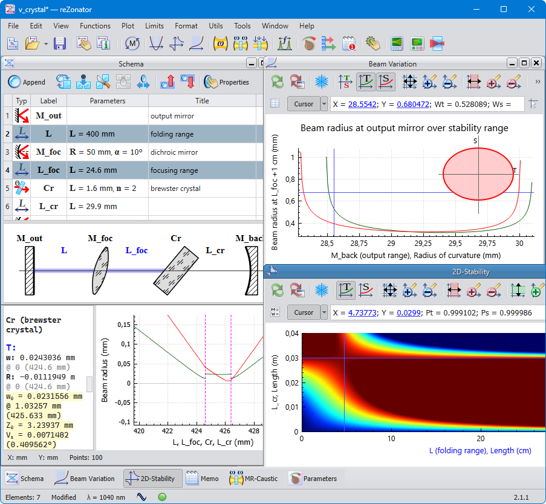

# reZonator

## About

[reZonator](http://rezonator.orion-project.org) a powerful cross-platform software for designing laser resonators and calculating light beam propagation (as Gaussian as ray vectors) in complex optical systems, not only resonators but also single-pass systems. It is [proven](http://rezonator.orion-project.org/?page=citation) to be useful by many people around the globe.

It's written by a professional programmer with many years of experience having a classical scientific background. Initially, it was done as a working tool for internal usage. So we know what we want from the tool and implement it as it would be convenient to use. Sure, different people have different understandings of what “convenience” means and different needs for features. So [suggestions and bug reports](https://github.com/orion-project/rezonator2/issues) are welcomed, and especially bug reports 🫣😀

See project's [Home page](http://rezonator.orion-project.org) or GitHub [Releases](https://github.com/orion-project/rezonator2/releases) page for binary packages for Windows, Linux, and macOS. See [build instructions](./docs/build.md) for building from source code.

## Motivation

Despite the number of good [examples](https://www.scilab.org), in the professional scientific software today there is still an ancient trend for wasting users's money even if the functions they offer are rather generic and straightforward and well-described in the literature. These days, most of such calculations could be carried out by a good student using just [Python](https://www.python.org). Python and its [libraries](https://numpy.org) are extremely powerful and [open-source](https://opensource.org), and it is a great example of in what direction software development, even commercial, goes in the modern world. Unlike commercial scientific software, it opens its internals and encourages users to learn and enhance, [almost](https://en.wikipedia.org/wiki/GNU_General_Public_License) not requesting anything back. This project follows the same open source principle. It tries to bring at least a bit of the same level of openness to the world of “scientific” software. It just offers you conventional, well-known [approaches](https://en.wikipedia.org/wiki/Ray_transfer_matrix_analysis), wrapping them into a convenient interface, not pretending it implements some “patented” algorithms that “only we know how to do, and we will keep it a secret.” Everyone can go to the sources, check the correctness, implement their own functions, or enhance the existing ones. It doesn't intend to offer all the features that paid monsters have, but to offer enough to to help and be useful.

## Features

- **Optical systems**
reZonator supports different [optical system types](http://rezonator.orion-project.org/help/trip_type.html) — standing wave laser cavities and running wave (ring) resonators, as well as conventional single-pass systems, e.g., pump roads or beam expanders. The M² beam quality factor also is taken into account for single-pass systems.

- **Optical elements**
Programs' [elements catalog](http://rezonator.orion-project.org/help/elements.html) contains many essential optical elements — ranges, lenses, mirrors, crystals, and many more. The ABCD ray matrix algorithm is used for simulation of optical elements, so you also can define your own element by providing its matrix. *⚡️Coming soon:* Fully custom elements where you can provide formulas for computing matrices from parameters.

- **Unrestricted design**
The app doesn't calculate any particular optical geometry. Instead, it is possible to construct an arbitrary optical system from proposed or user-defined optical elements. reZonator automatically creates a [rendition](http://rezonator.orion-project.org/help/layout.html) of the system under investigation — almost as if you could sketch it on a paper sheet or your drawing board.

- **Stability maps**
For advanced system optimization, reZonator can compute cavity stability maps against values of [one](http://rezonator.orion-project.org/help/func_stabmap.html) or [two](http://rezonator.orion-project.org/help/func_stabmap_2d.html) parameters of any element. Also, automatic computation of stability boundaries is provided.

- **Wavefront calculation**
reZonator can plot the size and the wavefront curvature radius of the Gaussian beam over [one](http://rezonator.orion-project.org/help/func_caustic.html) or a [few](http://rezonator.orion-project.org/help/func_caustic_mr.html) elements, astigmatism also taken into account. It is possible to compute beam size at any position inside the system. Automatic determination of the position and size of the waist at an element where it is, calculation of the radius of diffractive divergence, and other parameters of the [Gaussian beam](http://rezonator.orion-project.org/help/calc_gauss.html) are provided.

- **Tuning and adjustment**
The [adjustment]((http://rezonator.orion-project.org/help/adjust.html)) tool allows you to gradually change any parameter of any element — just like you rotate a screw of some mirror mount or a translating stage. Any results are instantly recalculated while the parameter value is changed.

- **Global parameters and formulas**
[Global parameters](http://rezonator.orion-project.org/help/params_window.html) can interconnect different elements; parameter values given by custom formulas allow you to construct a dynamic and parameterized system.

- **and more**
Other convenient and useful tools and functions are also available: [repetition rate](http://rezonator.orion-project.org/help/func_reprate.html), [beam parameters](http://rezonator.orion-project.org/help/func_beamdata.html) at all elements, misalignments of elements (*coming soon*), [“freezing”](http://rezonator.orion-project.org/help/func_freeze.html) results, full plot format customization, copying results to the clipboard, and more…

##

