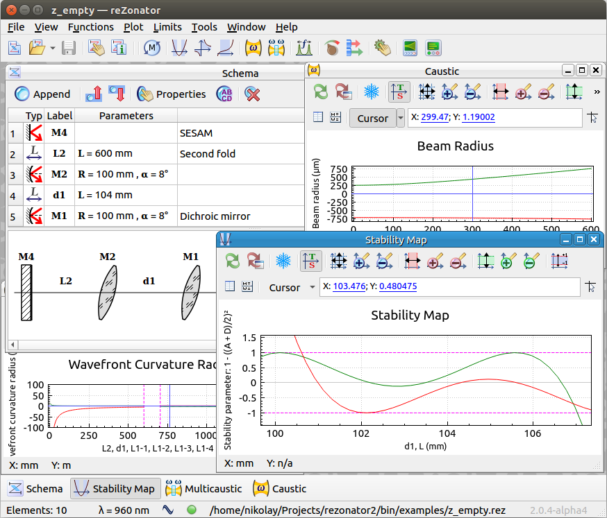

# reZonator 2

[reZonator](http://rezonator.orion-project.org) is a software for designing of laser resonators and calculation of light beam propagation (as gaussian so as ray vectors) in complex optical systems.

This is the official port of reZonator to [Qt](qt.io) framework. The goal is to make it open-source and cross-platform.

Currently, the version 2 is in beta state, it implements the most of functions of version 1 and also adds many new features. If you need some particular feature from version 1 that it no ported yet, or you need some new functionality, fill free to open an [issue](https://github.com/orion-project/rezonator2/issues) with a feature request.

See project's [Home page](http://rezonator.orion-project.org) or GitHub [Releases](https://github.com/orion-project/rezonator2/releases) page for binary packages for Windows, Linux and macOS. See [build instructions](./docs/build.md) for building from source code.

