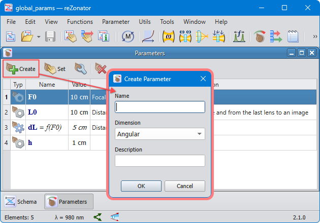

# Documentation

reZonator user manual is built using [Sphinx Documentation Builder](http://www.sphinx-doc.org).

## Prepare environment

The virtual environment shared between different project parts, e.g., `calc` and `help`, so it's better to make it on the project top level.

On Ubuntu `patchelf` package is required:

```bash
sudo apt-get install patchelf
```

Linux, macOS:

```bash
python3 -m venv .venv
source .venv/bin/activate
```

Windows (there is no `python3` command on Windows so be sure Python 3 is in the PATH):

```bash
python -m venv .venv
.venv\Scripts\activate
```

## Install requirements

For building help we only need

```bash
python -m pip install sphinx
```

## Build

Linux, macOS:

```bash
./make.sh
```

Windows:

```bash
make.bat
```

Target documentation is in `../out` directory.

## Notes

### Fonts

Main font size in the Assistant looks a bit small and ugly by default. It depends on the platform, so it's better to use the Assistant's View menu to adjust font size in runtime rather then settings it bigger in CSS files. Leave the body `font-size` undefined in styles. As for font family, the Assistant seems can't work with arbitrary fonts, its zoom command starts glitching and displayed font size can be even different for different runs. So probably it worth to stay the font face by default as well.

### Formulas

As the documentation contains a notable amount of physical formulas, they should be inserted as pictures. Qt Assistant uses `QTextDocument` to display help pages, and it has fewer abilities comparing to real browsers. Also, Assistant can't run JavaScript code. So pictures for formulas is the only possibility to display them.

Use the [render_formula.html](./render_formula.html) page as a simple formula editor to play with the TeX syntax. [Here](../docs/latex-symbols.md) we have a short handbook on TeX symbols. Once formula is finished in the editor and proved to be a valid TeX, it can be pasted into a RST document after the `tex` tag followed by respective `image` tag, e.g.: 

```
.. tex:
    \cfrac{1}{F} = (n - 1)\bigg[\, 
        \cfrac{1}{R_1} - 
        \cfrac{1}{R_2} + 
        \cfrac{(n -1)T}{n R_1 R_2}
    \bigg]\,

.. image:: img/calc_lens_f.png
```

`tex` is not a standard tag so sphinx just treats it as a comment. Then we have a [Node.js](https://nodejs.org) script that reads these tags and uses well known [MathJax](https://github.com/mathjax/MathJax) library for rendering TeX syntax into SVG format. Then the script converts each SVG formula into PNG image and save it into a file specified in the `image` tag.

Usage:

```bash
# Download MaxJax and additional libraries
npm install

# Generate PNG images for a single file
node render_formulas.js calc_lens.rst

# Update all formula images in all files
node render_formulas.js --overwrite *

# Run against several files and see what formulas in them (no files generated)
node render_formulas.js --dry-run calc_lens.rst calc_grin.rst
```

There also a number of ODF files that are LibreOffice Math formulas. They should be considered as deprecated and gradually replaced. Reasons are Math uses its own syntax instead of conventional TeX, and its rendered formulas do not have such nice appearance as those rendered by MathJax.

### Colors

For screenshots: `#FF494F` for buttons and arrows, `#FF7C7F` for window frames, e.g.



## RST cheat-sheet and some rules

See the full syntax in the [sphinx docs](https://www.sphinx-doc.org/en/master/usage/restructuredtext/index.html).

### Headers

The first level for chapters lister in `index.rst`, see `schema.rst`, `elements.rst`:

```
******
Schema
******
```

The second level is for individual topic files e.g. `params_window.rst`:

```
Gaussian Beam Calculator
========================
```

The third level is for subtopics inside of topic files:

```
Calculation Algorithm
---------------------
```

The fourth and fifth levels are for most inner subtopics:

```
Change waist
^^^^^^^^^^^^

Lock waist
~~~~~~~~~~
When locking waist then bla-bla-bla...

Lock front
~~~~~~~~~~
When locking front then bla-bla-bla...
```

### Index entries

```
.. index:: single: global parameter
```

### Navigation anchors

Set an anchor in the text you can navigate to:

```
.. _pump_mode_vector:

Ray Vector 
----------

section text bla-bla-bla...
```

this creates an id in the target html:

```html
<div class="section" id="ray-vector">
<span id="pump-mode-vector"></span><h2>Ray Vector</h2>
```

It's seen that the section title also creates an anchor: `Ray Vector --> id="ray-vector"`.

Then it can be used in code to navigate to the help topic, something like:

```cpp
QString PumpParamsDialog::helpTopic() const
{
    return "pump_mode.html#" + _params->modeName().toLower();
}
```

### Cross references

Manually named reference to an anchor:

```
:ref:`Waist <pump_mode_waist>`
```

Automatically named reference to a doc:

```
:doc:`input_beam`
```

Manually named reference to a doc:

```
:doc:`Input beam<input_beam>`
```

External link

```
This is the Lua `original documentation <https://www.lua.org/manual/5.3/>`_ for the reference.
```
