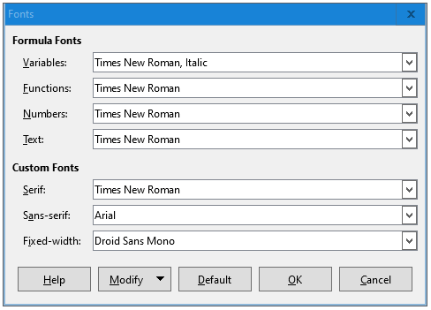

# Element matrices

## `*.odf`
*LibreOffice Math* files containing formula code.
Formula images should be exported via print-screen at font size **18pt** and using these font settings:

## `*.svg`
*Inkscape* drawings for elements. These are used when additional stuff is needed to hint formula parameters. In general, drawings are in `../../img/elems` directory.

## `*.xcf`
*GIMP* files defining layout of drawings and formulas.

Use these settings for exporting `png` files:

