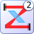
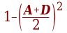
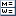

# Images

## Root dir
Images used as shape sources, obsolete images, or images moved from rezonator-1 but not used yet.

**TODO:** Root dir should contain as little images as possible.

## drawing
Images that are used as tips/infos/descriptions in the application.

## elems
Element icons.

**TODO:** Move images from `../elems` here.

## icon
Images that are used as window header icons.

## misc
This dir should contain images that are nor toolbar glyphs or window icons.

**TODO:** Move here some images from root dir (e.g. `glass_pattern_32.png`).

## svg
Images used as shape sources, some obsolete images, or images moved from rezonator-1 but not used yet.

**TODO:** Should be eliminated.

## toolbar
Images mainly intended to be displayed in toolbars buttons and push buttons.

They should be `svg` images of any sizes (128x128, 512x512), but they should look fine even at small scales - 16x16, 24x24.

## toolbar16
Images optimized for 16x16 size only. They are shown in menus or small buttons.

